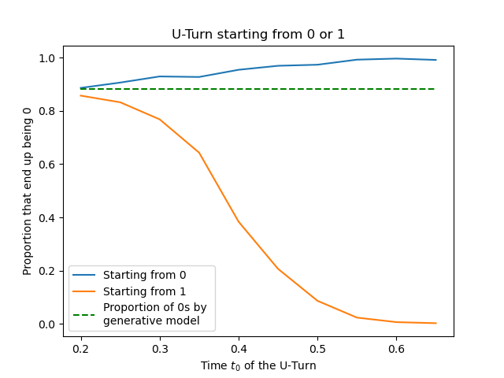

# Code for Phase-aware Training Schedule Simplifies Learning in Flow-Based Generative Models
This is the official repo for the experiments from the paper [Phase-aware Training Schedule Simplifies Learning in Flow-Based Generative Models](https://arxiv.org/abs/2412.07972) by S. Aranguri and F. Insulla (under review).

## Generating MNIST digits
In the `mnist` folder there is an implementation of a score-based diffusion model using an U-Net to generate MNIST digits which shows that the way we propose to train in our paper improves class accuracy more than 5x over regular methods when trained on a limited number of epochs. To be more precise, we train on an unbalanced dataset that contains 80% images with the 0 digit and 20% with the 1 digit. The file `mnist/main.ipynb` implements the training of the model and the U-Turn which together with a discriminator in `mnist/classifier.ipynb` determine at what time in the generation process the digit being a 0 or a 1 is decided. This is used to generate the following (see Figure 2 in the paper) 

Then, by training from scratch again using `mnist/main.ipynb` but drawing more datapoints in the region of time [.2, .6] we obtained 5x improvements in class accuracy over training with a uniform grid when trained on a limited number of epochs (see paper for precise claims.)

## Numerical check of theoretical predictions
In the `theoretical_predictions` folder, there is `learnGMM.py` which implements a neural network that is trained to generated sample from a mixture of two gaussians. Further, in `overlaps.ipynb` we provide the code to numerically check the agreement between the theoretical predictions made in the paper for the learned weights against actual values of the weights for SGD trained neural network. 
